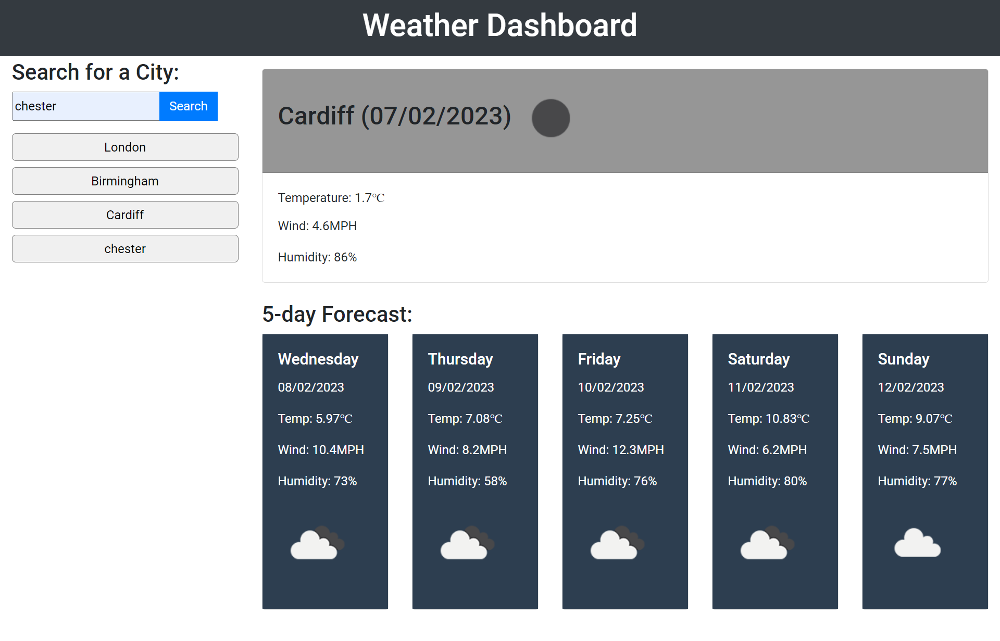

# Weather Dasboard
This is a webpage for users to search and get basic current and 5-day weather information (including temperature, windspeed and humidity) in any city of their choice.

## Installation 
N/A

## Usage
To access this webpage click in this link https://hurlavic.github.io/Weather-Dasboard/. It's basic and simple to use and navigate. Enter your city (or any city of interest) in the search field and click on the search button. This wil generate and display your search results to the right of the search field, with this, you get information about the current weather and a 5-day forecast of the same city. History buttons are generated under the search field based on the cities you have entered, and you can view the weather information of these cities by clicking on the buttons.

## Mock-Up

## Credit
N/A

## License
Pls refer to license in repo.